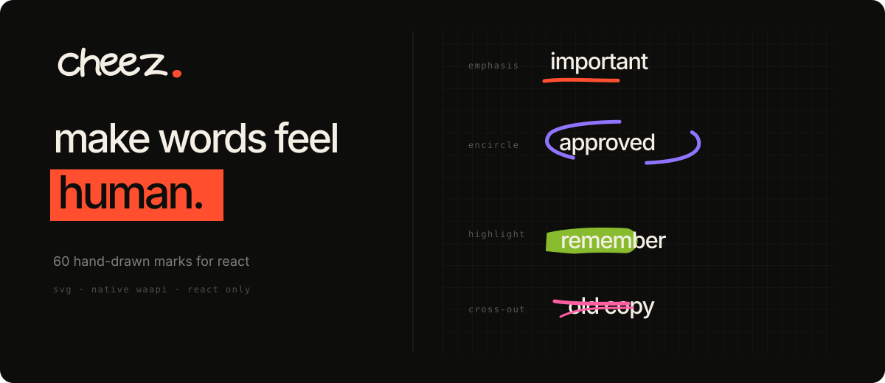
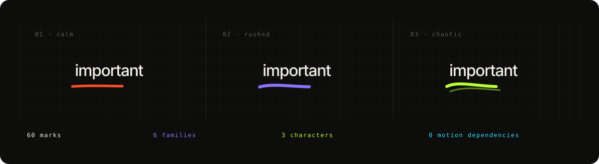

<p align="center">
  <a href="https://berkant.me/cheez">
    
  </a>
</p>

<p align="center">
  <strong>sixty hand-drawn marks for react.</strong><br />
  underline, circle, overwrite, highlight, arrows, symbols, and the strange bits in between.
</p>

<p align="center">
  <a href="https://berkant.me/cheez">demo</a>
  ·
  <a href="https://www.npmjs.com/package/@berkantay/cheez">npm</a>
  ·
  <a href="#shadcn-registry">shadcn registry</a>
  ·
  <a href="./LICENSE">mit</a>
</p>

## why

digital words feel too perfect. cheez adds the wobble back.

It renders responsive SVG marks, then hands playback to the browser's native
Web Animations API. React composes the mark; React does not run every frame.
There is no Framer Motion dependency and no canvas.

<p align="center">
  
</p>

## shadcn registry

Install the full source collection directly into your project:

```bash
# bun
bunx shadcn@latest add berkantay/cheez/cheez

# npm
npx shadcn@latest add berkantay/cheez/cheez

# pnpm
pnpm dlx shadcn@latest add berkantay/cheez/cheez
```

```tsx
import { Cheez } from "@/components/cheez/cheez"

export function Important() {
  return (
    <Cheez type="wavy-underline" character="rushed" color="#b7ff3c">
      important detail
    </Cheez>
  )
}
```

The full item is self-contained. Focused registry items are also available:
`underline`, `circle`, `highlight`, `overwrite`, and `cheez-core`.

## package

```bash
bun add @berkantay/cheez
npm install @berkantay/cheez
pnpm add @berkantay/cheez
```

```tsx
import { Cheez } from "@berkantay/cheez"

export function Approved() {
  return (
    <Cheez type="loose-circle" character="calm" color="#8f74ff">
      approved
    </Cheez>
  )
}
```

## the small api

```tsx
<Cheez
  type="scribble-out"
  character="chaotic"
  color="#ff5fa2"
  trigger="in-view"
  duration={520}
  delay={80}
>
  old copy
</Cheez>
```

| prop | values | default |
| --- | --- | --- |
| `type` | one of 60 typed mark names | required |
| `character` | `calm` · `rushed` · `chaotic` | `calm` |
| `trigger` | `mount` · `in-view` · `manual` | `mount` |
| `color` | any CSS color | `currentColor` |
| `duration` | milliseconds | mark timing |
| `delay` | milliseconds | `0` |

Use a ref with `trigger="manual"` when replay belongs to your interface:

```tsx
import { useRef } from "react"
import type { CheezMarkHandle } from "@berkantay/cheez"

const mark = useRef<CheezMarkHandle>(null)

<Cheez ref={mark} trigger="manual" type="underline">
  replay me
</Cheez>

mark.current?.play()
```

## families

| family | examples |
| --- | --- |
| emphasis | underline, double underline, wavy underline |
| encircle | circle, oval, box, brackets, bubble |
| cross-out | overwrite, strike-through, scribble-out |
| highlight | marker, half highlight, brush highlight |
| arrow | up, down, curved, loop, double arrow |
| symbol | check, x, question, star, burst, heart |

## development

```bash
bun install
bun run dev
bun run check
```

The installable source lives in [`registry/default`](./registry/default). The
shared renderer and motion engine live in `cheez-core`; mark files contain path
and timing data. Keep those layers separate and adding the next mark stays
boring.

## license

[MIT](./LICENSE) © Berkant Ay
